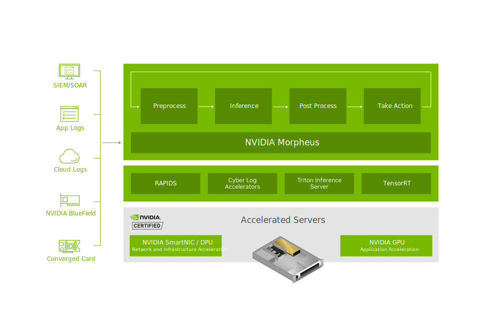

# 0. Introdução ao Morpheus

O [Morpheus](https://developer.nvidia.com/morpheus-cybersecurity) é uma Framework de segurança cibernética da NVIDIA de código aberto, ==acelerada por GPU==, que permite a criação de pipelines otimizados para ^^filtrar^^, ^^processar^^ e ^^classificar^^ um grande volume de dados ==em tempo real== permitindo uma detecção mais rápida.

<figure markdown="span">
    {width=800}
</figure>

## Principais recursos

- A aceleração da GPU no Morpheus oferece o mais alto desempenho, em grande escala, permitindo que as empresas inspecionem e analisem todos os dados e tráfego em toda a rede, incluindo data center, edge, gateway e computação centralizada.
- Aproveita inferência e aceleração de GPU em escala (até 600 vezes mais rápida do que soluções somente de CPU) reduzindo o tempo de detecção de semanas para minutos.

## Benefícios

- Permite que desenvolvedores **criem suas próprias soluções** de segurança cibernética.
- Permite a **adaptação dinâmica** a feedback humano e eventos externos, melhorando a precisão e a capacidade de resposta dos modelos de IA.
- Possível Implementar o próprio modelo ou alguns dos modelos pré-treinados e testados pela própria NVIDIA.