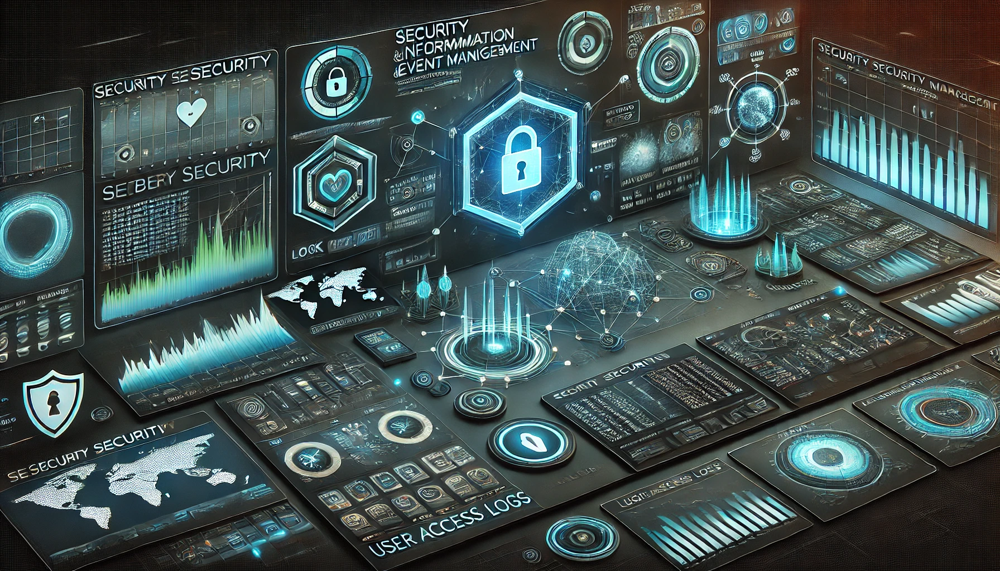

# 0. Introdução ao SIEM

## Conceito e Objetivo de um SIEM

Um SIEM (Security Information and Event Management) é uma solução que integra duas tecnologias principais, o SEM (Security Event Management) e o SIM (Security Information Management), para monitorar, analisar e responder a eventos de segurança em uma rede.

!!! note
    :material-directions-fork: **SEM (Security Event Management)**  
    Processo de monitoramento e análise de eventos de segurança para identificar padrões suspeitos e gerar alertas para incidentes de segurança.

    :fontawesome-solid-magnifying-glass: **SIM (Security Information Management)**  
    Processo de coleta, armazenamento e análise de dados históricos relacionados à segurança provenientes de várias fontes.  

<figure markdown="span">
{width=800}
</figure>

O SIEM é responsável por várias funções, como ^^coleta de logs^^, ^^armazenamento^^, ^^correlação^^, ^^criação de relatórios^^. Com o SIEM, é possível ==detectar sinais de comportamentos suspeitos ou padrões que precedem um ataque==, tornando-se, assim, uma das principais ferramentas para a segurança da informação.

## Funcionamento e Estrutura de um SIEM

O SIEM coleta dados de várias fontes, incluindo computadores, dispositivos de rede, servidores, entre outros. Esses dados são então normalizados para facilitar a análise pela ferramenta de correlação de eventos. Quando uma ameaça é identificada, uma notificação é enviada à equipe de segurança para que a situação seja investigada e/ou bloqueada automaticamente por outras ferramentas.

Uma solução SIEM coleta logs por vários protocolos e tipos de conectores (por exemplo, Syslog, SNMP, API, etc.), ao recebê-los, é preciso diversas funcionalidades além da coleta, tais como:

- Administração de logs
- Capacidade de examinar logs e outros tipos de dados
- Tratamento de incidentes
- Resumos visuais (relatórios, gráficos, etc.)
- Documentação

!!! warning
    Um SIEM não substitui outras ferramentas de monitoramento; ele opera em conjunto com elas, processando dados de logs para identificar eventos que podem levar à exploração do sistema.

## Principais Requisitos para Implementação de um SIEM

- **Agregação e normalização de logs**  
Uma das principais funções de um SIEM é agregar logs de várias fontes e normaliza-los para padronizar os dados, facilitando o processo de correlação posteriormente e permitindo uma analise mais precisa.

- **Alertas de ameaças**  
Ao identificar uma possível ameaça, o SIEM gera um alerta que pode ser configurado pela equipe de SOC para acionar notificações, como envio de e-mails, atualização de dashboards, entre outros.

- **Contextualização e resposta**  
Apenas gerar alertas não é suficiente, pois podem ocorrer falsos positivos se o sistema não for configurado corretamente, sobrecarregando a equipe de segurança. A contextualização permite que a equipe filtre ameaças genuínas com mais precisão. A contextualização geralmente depende de regras e do uso de análises adicionais.

- **Conformidade**  
O SIEM ajuda as organizações a atender requisitos regulatórios, como PCI DSS, HIPAA e GDPR, que exigem medidas robustas de segurança. Soluções SIEM também oferecem recursos para automação de relatórios, um recurso essencial para conformidade.

## Processamento e Fluxo de Dados em um SIEM

1. A solução SIEM agrega logs de várias fontes.
2. Os dados coletados são processados e normalizados para que possam ser compreendidos pela ferramenta SIEM. Os dados brutos precisam ser gravados ou lidos em um formato que a ferramenta entenda e, então, convertidos para um formato comum a partir de diversos tipos de conjuntos de dados (normalização e agregação de dados).
3. ==A parte crucial de um SIEM==: a equipe de SOC utiliza os dados normalizados para criar regras de detecção, painéis, visualizações, alertas e incidentes. Isso permite que a equipe de SOC identifique rapidamente possíveis riscos, minimizando os danos.

## Benefícios de Utilizar um SIEM

Sem um SIEM, a equipe de segurança de TI não teria uma visão centralizada de todos os dados e eventos em tempo real vindos de diferentes fontes, o que aumentaria o tempo de investigação. Por exemplo, se um firewall registra cinco tentativas de login incorretas, resultando no bloqueio da conta de administrador, é essencial ter um ==sistema centralizado de registros== que correlacione esses eventos para monitorar a situação.

## Desafios e Limitações dos SIEMs Atuais

Existem limitações na abordagem baseada em regras usada nos módulos de correlação, como a ^^necessidade constante de atualizar as regras^^ e a ^^dificuldade em detectar ameaças avançadas^^, como ataques de dia zero e ameaças persistentes (APT). Outra limitação comum é o volume de falsos positivos, que exige a intervenção humana para priorizar eventos.
